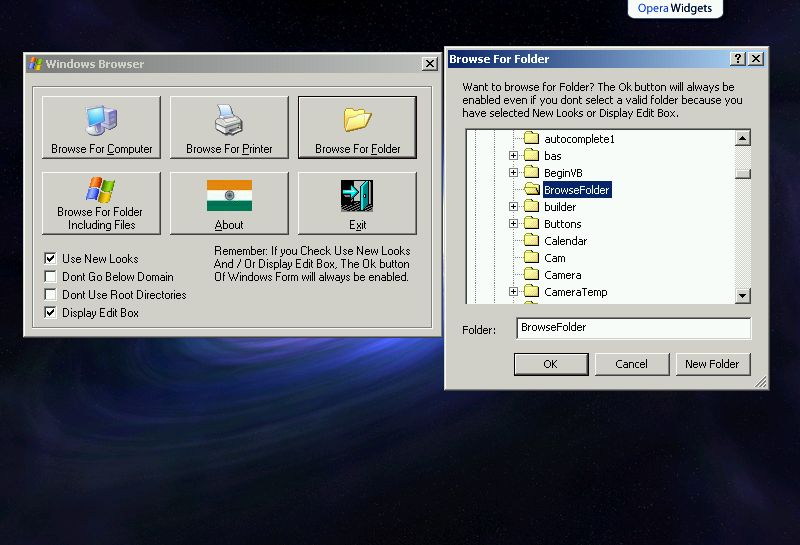

<div align="center">

## Browse Folder or Computer or File or Printer using Windows original form\. Purely API based\.


</div>

### Description

Ever wanted to use the Windows original form for selecting printer / computer / folder or file? No need to create your own form. No need of any control such as drive list box, Folder List Box etc. This one is for you. Try it, purely API based.

Vote if you think that it may be useful for you at some stage!

Thanks!
 
### More Info
 


<span>             |<span>
---                |---
**Submitted On**   |2006-07-06 08:20:02
**By**             |[Amol Tarte](https://github.com/Planet-Source-Code/PSCIndex/blob/master/ByAuthor/amol-tarte.md)
**Level**          |Advanced
**User Rating**    |4.0 (12 globes from 3 users)
**Compatibility**  |VB 5\.0, VB 6\.0
**Category**       |[Coding Standards](https://github.com/Planet-Source-Code/PSCIndex/blob/master/ByCategory/coding-standards__1-43.md)
**World**          |[Visual Basic](https://github.com/Planet-Source-Code/PSCIndex/blob/master/ByWorld/visual-basic.md)
**Archive File**   |[Browse\_Fol200470762006\.zip](https://github.com/Planet-Source-Code/amol-tarte-browse-folder-or-computer-or-file-or-printer-using-windows-original-form-purely__1-65879/archive/master.zip)

### API Declarations

```
Option Explicit
Public Declare Function SHBrowseForFolder Lib "shell32.dll" (ByRef lpbi As BROWSEINFO) As Long
Public Declare Function LocalAlloc Lib "kernel32" (ByVal uFlags As Long, ByVal uBytes As Long) As Long
Public Declare Function LocalFree Lib "kernel32" (ByVal hMem As Long) As Long
Public Declare Sub CopyMemory Lib "kernel32" Alias "RtlMoveMemory" (pDest As Any, pSource As Any, ByVal dwLength As Long)
Public Declare Function SHGetPathFromIDList Lib "shell32.dll" Alias "SHGetPathFromIDListA" (ByVal pidl As Long, ByVal pszPath As String) As Long
Public Declare Sub CoTaskMemFree Lib "ole32.dll" (ByVal pv As Long)
Public Declare Function SendMessage Lib "user32" Alias "SendMessageA" (ByVal hWnd As Long, ByVal wMsg As Long, ByVal wParam As Long, lParam As Any) As Long
Public Type BROWSEINFO
  hOwner As Long
  pidlRoot As Long
  pszDisplayName As String
  lpszTitle As String
  ulFlags As Long
  lpfn As Long
  lParam As Long
  iImage As Long
End Type
Public Const BIF_NEWDIALOGSTYLE As Long = &amp;H40
Public Const BIF_BROWSEFORCOMPUTER As Long = &amp;H1000
Public Const BIF_BROWSEFORPRINTER As Long = &amp;H2000
Public Const BIF_BROWSEINCLUDEFILES As Long = &amp;H4000
Public Const BIF_BROWSEINCLUDEURLS As Long = &amp;H80
Public Const BIF_DONTGOBELOWDOMAIN As Long = &amp;H2
Public Const BIF_EDITBOX As Long = &amp;H10
Public Const BIF_RETURNFSANCESTORS As Long = &amp;H8
Public Const BIF_RETURNONLYFSDIRS As Long = &amp;H1
Public Const BIF_SHAREABLE As Long = &amp;H8000
Public Const BIF_STATUSTEXT As Long = &amp;H4
Public Const BIF_USENEWUI As Long = &amp;H40
Public Const BIF_VALIDATE As Long = &amp;H20
Public Const MAX_PATH As Long = 260
Public Const WM_USER = &amp;H400
Public Const LMEM_FIXED = &amp;H0
Public Const LMEM_ZEROINIT = &amp;H40
Public Const LPTR = (LMEM_FIXED Or LMEM_ZEROINIT)
Public Const BFFM_INITIALIZED As Long = 1
Public Const BFFM_SETSELECTIONA As Long = (WM_USER + 102)
```


